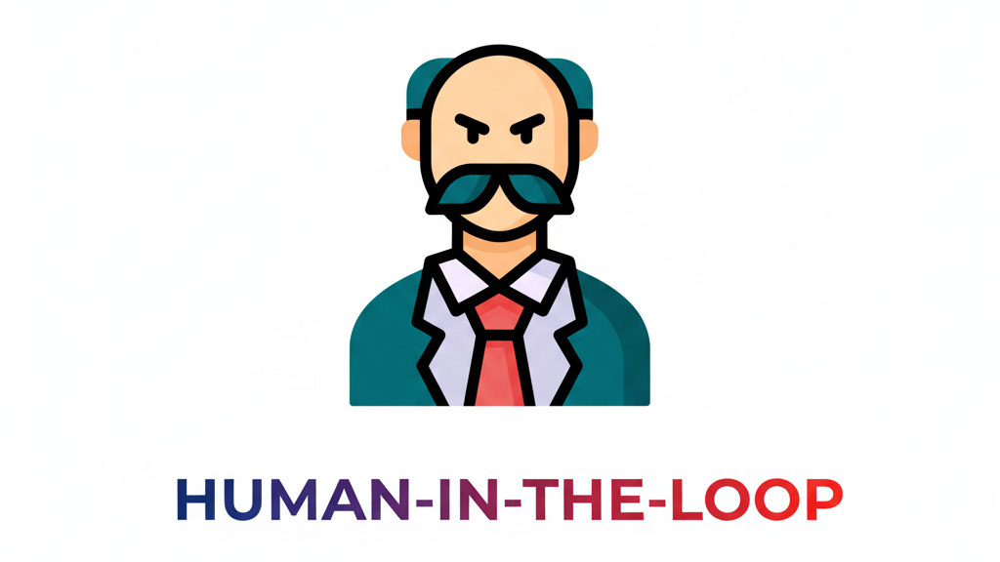

<div align="center">



# Human-In-The-Loop MCP

</div>

## ⚡️ Quick start

Give your AI a human touch. Sometimes machines need to ask for help.

## What is this?

A Model Context Protocol (MCP) server that enables human oversight for AI assistants through Discord or HTTP. When your AI needs clarification or approval, it can reach out to you directly.

## 🛠️ Installation

### Requirements

- Node.js >= v20.0.0 or Bun >= 1.2.20
- Discord Bot Token or HTTP endpoint
- An MCP Client (Claude Desktop, Cursor, VSCode, etc.)

<details>
<summary><b>Install in Smithery</b></summary>

To install Human-In-The-Loop MCP for Claude Desktop automatically via [Smithery](https://smithery.ai/server/human-in-the-loop-mcp):

```bash
npx @smithery/cli install human-in-the-loop-mcp --client claude
```

</details>

<details>
<summary><b>Install in Cursor</b></summary>

#### Via bunx
```json
{
  "mcpServers": {
    "human-in-the-loop": {
      "command": "bunx",
      "args": [
        "human-in-the-loop-mcp",
        "discord",
        "--token", "YOUR_DISCORD_BOT_TOKEN",
        "--user-id", "YOUR_DISCORD_USER_ID"
      ]
    }
  }
}
```

#### Via npx
```json
{
  "mcpServers": {
    "human-in-the-loop": {
      "command": "npx",
      "args": [
        "-y",
        "human-in-the-loop-mcp",
        "discord",
        "--token", "YOUR_DISCORD_BOT_TOKEN",
        "--user-id", "YOUR_DISCORD_USER_ID"
      ]
    }
  }
}
```

</details>

<details>
<summary><b>Install in Claude Code</b></summary>

#### Via bunx
```json
{
  "mcpServers": {
    "human-in-the-loop": {
      "command": "bunx",
      "args": [
        "human-in-the-loop-mcp",
        "discord",
        "--token", "YOUR_DISCORD_BOT_TOKEN",
        "--user-id", "YOUR_DISCORD_USER_ID"
      ]
    }
  }
}
```

#### Via npx
```json
{
  "mcpServers": {
    "human-in-the-loop": {
      "command": "npx",
      "args": [
        "-y",
        "human-in-the-loop-mcp",
        "discord",
        "--token", "YOUR_DISCORD_BOT_TOKEN",
        "--user-id", "YOUR_DISCORD_USER_ID"
      ]
    }
  }
}
```

</details>

<details>
<summary><b>Install in Windsurf</b></summary>

#### Via bunx
```json
{
  "mcpServers": {
    "human-in-the-loop": {
      "command": "bunx",
      "args": [
        "human-in-the-loop-mcp",
        "discord",
        "--token", "YOUR_DISCORD_BOT_TOKEN",
        "--user-id", "YOUR_DISCORD_USER_ID"
      ]
    }
  }
}
```

#### Via npx
```json
{
  "mcpServers": {
    "human-in-the-loop": {
      "command": "npx",
      "args": [
        "-y",
        "human-in-the-loop-mcp",
        "discord",
        "--token", "YOUR_DISCORD_BOT_TOKEN",
        "--user-id", "YOUR_DISCORD_USER_ID"
      ]
    }
  }
}
```

</details>

<details>
<summary><b>Install in VS Code</b></summary>

#### Via bunx
```json
{
  "mcpServers": {
    "human-in-the-loop": {
      "command": "bunx",
      "args": [
        "human-in-the-loop-mcp",
        "http",
        "--url", "https://your-endpoint.com/questions"
      ]
    }
  }
}
```

#### Via npx
```json
{
  "mcpServers": {
    "human-in-the-loop": {
      "command": "npx",
      "args": [
        "-y",
        "human-in-the-loop-mcp",
        "http",
        "--url", "https://your-endpoint.com/questions"
      ]
    }
  }
}
```

</details>

<details>
<summary><b>Install in Cline</b></summary>

#### Via bunx
```json
{
  "mcpServers": {
    "human-in-the-loop": {
      "command": "bunx",
      "args": [
        "human-in-the-loop-mcp",
        "discord",
        "--token", "YOUR_DISCORD_BOT_TOKEN",
        "--user-id", "YOUR_DISCORD_USER_ID"
      ]
    }
  }
}
```

#### Via npx
```json
{
  "mcpServers": {
    "human-in-the-loop": {
      "command": "npx",
      "args": [
        "-y",
        "human-in-the-loop-mcp",
        "discord",
        "--token", "YOUR_DISCORD_BOT_TOKEN",
        "--user-id", "YOUR_DISCORD_USER_ID"
      ]
    }
  }
}
```

</details>

<details>
<summary><b>Install in Zed</b></summary>

#### Via bunx
```json
{
  "mcpServers": {
    "human-in-the-loop": {
      "command": "bunx",
      "args": [
        "human-in-the-loop-mcp",
        "discord",
        "--token", "YOUR_DISCORD_BOT_TOKEN",
        "--user-id", "YOUR_DISCORD_USER_ID"
      ]
    }
  }
}
```

#### Via npx
```json
{
  "mcpServers": {
    "human-in-the-loop": {
      "command": "npx",
      "args": [
        "-y",
        "human-in-the-loop-mcp",
        "discord",
        "--token", "YOUR_DISCORD_BOT_TOKEN",
        "--user-id", "YOUR_DISCORD_USER_ID"
      ]
    }
  }
}
```

</details>

<details>
<summary><b>Install in Augment Code</b></summary>

#### Via bunx
```json
{
  "mcpServers": {
    "human-in-the-loop": {
      "command": "bunx",
      "args": [
        "human-in-the-loop-mcp",
        "discord",
        "--token", "YOUR_DISCORD_BOT_TOKEN",
        "--user-id", "YOUR_DISCORD_USER_ID"
      ]
    }
  }
}
```

#### Via npx
```json
{
  "mcpServers": {
    "human-in-the-loop": {
      "command": "npx",
      "args": [
        "-y",
        "human-in-the-loop-mcp",
        "discord",
        "--token", "YOUR_DISCORD_BOT_TOKEN",
        "--user-id", "YOUR_DISCORD_USER_ID"
      ]
    }
  }
}
```

</details>

<details>
<summary><b>Install in Roo Code</b></summary>

#### Via bunx
```json
{
  "mcpServers": {
    "human-in-the-loop": {
      "command": "bunx",
      "args": [
        "human-in-the-loop-mcp",
        "discord",
        "--token", "YOUR_DISCORD_BOT_TOKEN",
        "--user-id", "YOUR_DISCORD_USER_ID"
      ]
    }
  }
}
```

#### Via npx
```json
{
  "mcpServers": {
    "human-in-the-loop": {
      "command": "npx",
      "args": [
        "-y",
        "human-in-the-loop-mcp",
        "discord",
        "--token", "YOUR_DISCORD_BOT_TOKEN",
        "--user-id", "YOUR_DISCORD_USER_ID"
      ]
    }
  }
}
```

</details>

<details>
<summary><b>Install in Gemini CLI</b></summary>

#### Via bunx
```json
{
  "mcpServers": {
    "human-in-the-loop": {
      "command": "bunx",
      "args": [
        "human-in-the-loop-mcp",
        "discord",
        "--token", "YOUR_DISCORD_BOT_TOKEN",
        "--user-id", "YOUR_DISCORD_USER_ID"
      ]
    }
  }
}
```

#### Via npx
```json
{
  "mcpServers": {
    "human-in-the-loop": {
      "command": "npx",
      "args": [
        "-y",
        "human-in-the-loop-mcp",
        "discord",
        "--token", "YOUR_DISCORD_BOT_TOKEN",
        "--user-id", "YOUR_DISCORD_USER_ID"
      ]
    }
  }
}
```

</details>

<details>
<summary><b>Install in Claude Desktop</b></summary>

#### Via bunx
```json
{
  "mcpServers": {
    "human-in-the-loop": {
      "command": "bunx",
      "args": [
        "human-in-the-loop-mcp",
        "discord",
        "--token", "YOUR_DISCORD_BOT_TOKEN",
        "--user-id", "YOUR_DISCORD_USER_ID"
      ]
    }
  }
}
```

#### Via npx
```json
{
  "mcpServers": {
    "human-in-the-loop": {
      "command": "npx",
      "args": [
        "-y",
        "human-in-the-loop-mcp",
        "discord",
        "--token", "YOUR_DISCORD_BOT_TOKEN",
        "--user-id", "YOUR_DISCORD_USER_ID"
      ]
    }
  }
}
```

</details>

<details>
<summary><b>Install in Opencode</b></summary>

#### Via bunx
```json
{
  "mcpServers": {
    "human-in-the-loop": {
      "command": "bunx",
      "args": [
        "human-in-the-loop-mcp",
        "discord",
        "--token", "YOUR_DISCORD_BOT_TOKEN",
        "--user-id", "YOUR_DISCORD_USER_ID"
      ]
    }
  }
}
```

#### Via npx
```json
{
  "mcpServers": {
    "human-in-the-loop": {
      "command": "npx",
      "args": [
        "-y",
        "human-in-the-loop-mcp",
        "discord",
        "--token", "YOUR_DISCORD_BOT_TOKEN",
        "--user-id", "YOUR_DISCORD_USER_ID"
      ]
    }
  }
}
```

</details>

<details>
<summary><b>Install in OpenAI Codex</b></summary>

#### Via bunx
```json
{
  "mcpServers": {
    "human-in-the-loop": {
      "command": "bunx",
      "args": [
        "human-in-the-loop-mcp",
        "discord",
        "--token", "YOUR_DISCORD_BOT_TOKEN",
        "--user-id", "YOUR_DISCORD_USER_ID"
      ]
    }
  }
}
```

#### Via npx
```json
{
  "mcpServers": {
    "human-in-the-loop": {
      "command": "npx",
      "args": [
        "-y",
        "human-in-the-loop-mcp",
        "discord",
        "--token", "YOUR_DISCORD_BOT_TOKEN",
        "--user-id", "YOUR_DISCORD_USER_ID"
      ]
    }
  }
}
```

</details>

<details>
<summary><b>Install in JetBrains AI Assistant</b></summary>

#### Via bunx
```json
{
  "mcpServers": {
    "human-in-the-loop": {
      "command": "bunx",
      "args": [
        "human-in-the-loop-mcp",
        "discord",
        "--token", "YOUR_DISCORD_BOT_TOKEN",
        "--user-id", "YOUR_DISCORD_USER_ID"
      ]
    }
  }
}
```

#### Via npx
```json
{
  "mcpServers": {
    "human-in-the-loop": {
      "command": "npx",
      "args": [
        "-y",
        "human-in-the-loop-mcp",
        "discord",
        "--token", "YOUR_DISCORD_BOT_TOKEN",
        "--user-id", "YOUR_DISCORD_USER_ID"
      ]
    }
  }
}
```

</details>

<details>
<summary><b>Install in Kiro</b></summary>

#### Via bunx
```json
{
  "mcpServers": {
    "human-in-the-loop": {
      "command": "bunx",
      "args": [
        "human-in-the-loop-mcp",
        "discord",
        "--token", "YOUR_DISCORD_BOT_TOKEN",
        "--user-id", "YOUR_DISCORD_USER_ID"
      ]
    }
  }
}
```

#### Via npx
```json
{
  "mcpServers": {
    "human-in-the-loop": {
      "command": "npx",
      "args": [
        "-y",
        "human-in-the-loop-mcp",
        "discord",
        "--token", "YOUR_DISCORD_BOT_TOKEN",
        "--user-id", "YOUR_DISCORD_USER_ID"
      ]
    }
  }
}
```

</details>

<details>
<summary><b>Install in Trae</b></summary>

#### Via bunx
```json
{
  "mcpServers": {
    "human-in-the-loop": {
      "command": "bunx",
      "args": [
        "human-in-the-loop-mcp",
        "discord",
        "--token", "YOUR_DISCORD_BOT_TOKEN",
        "--user-id", "YOUR_DISCORD_USER_ID"
      ]
    }
  }
}
```

#### Via npx
```json
{
  "mcpServers": {
    "human-in-the-loop": {
      "command": "npx",
      "args": [
        "-y",
        "human-in-the-loop-mcp",
        "discord",
        "--token", "YOUR_DISCORD_BOT_TOKEN",
        "--user-id", "YOUR_DISCORD_USER_ID"
      ]
    }
  }
}
```

</details>

<details>
<summary><b>Install with Bun or Deno</b></summary>

### Bun

```bash
bunx human-in-the-loop-mcp discord --token YOUR_DISCORD_BOT_TOKEN --user-id YOUR_DISCORD_USER_ID
```

### Deno

```bash
deno run -A npm:human-in-the-loop-mcp discord --token YOUR_DISCORD_BOT_TOKEN --user-id YOUR_DISCORD_USER_ID
```

</details>


<details>
<summary><b>Install in Desktop Extension</b></summary>

#### Via bunx
```json
{
  "mcpServers": {
    "human-in-the-loop": {
      "command": "bunx",
      "args": [
        "human-in-the-loop-mcp",
        "discord",
        "--token", "YOUR_DISCORD_BOT_TOKEN",
        "--user-id", "YOUR_DISCORD_USER_ID"
      ]
    }
  }
}
```

#### Via npx
```json
{
  "mcpServers": {
    "human-in-the-loop": {
      "command": "npx",
      "args": [
        "-y",
        "human-in-the-loop-mcp",
        "discord",
        "--token", "YOUR_DISCORD_BOT_TOKEN",
        "--user-id", "YOUR_DISCORD_USER_ID"
      ]
    }
  }
}
```

</details>

<details>
<summary><b>Install on Windows</b></summary>

#### Via npx.cmd
```json
{
  "mcpServers": {
    "human-in-the-loop": {
      "command": "npx.cmd",
      "args": [
        "-y",
        "human-in-the-loop-mcp",
        "discord",
        "--token", "YOUR_DISCORD_BOT_TOKEN",
        "--user-id", "YOUR_DISCORD_USER_ID"
      ]
    }
  }
}
```

</details>

<details>
<summary><b>Install in Amazon Q Developer CLI</b></summary>

#### Via bunx
```json
{
  "mcpServers": {
    "human-in-the-loop": {
      "command": "bunx",
      "args": [
        "human-in-the-loop-mcp",
        "discord",
        "--token", "YOUR_DISCORD_BOT_TOKEN",
        "--user-id", "YOUR_DISCORD_USER_ID"
      ]
    }
  }
}
```

#### Via npx
```json
{
  "mcpServers": {
    "human-in-the-loop": {
      "command": "npx",
      "args": [
        "-y",
        "human-in-the-loop-mcp",
        "discord",
        "--token", "YOUR_DISCORD_BOT_TOKEN",
        "--user-id", "YOUR_DISCORD_USER_ID"
      ]
    }
  }
}
```

</details>

<details>
<summary><b>Install in Warp</b></summary>

#### Via bunx
```json
{
  "mcpServers": {
    "human-in-the-loop": {
      "command": "bunx",
      "args": [
        "human-in-the-loop-mcp",
        "discord",
        "--token", "YOUR_DISCORD_BOT_TOKEN",
        "--user-id", "YOUR_DISCORD_USER_ID"
      ]
    }
  }
}
```

#### Via npx
```json
{
  "mcpServers": {
    "human-in-the-loop": {
      "command": "npx",
      "args": [
        "-y",
        "human-in-the-loop-mcp",
        "discord",
        "--token", "YOUR_DISCORD_BOT_TOKEN",
        "--user-id", "YOUR_DISCORD_USER_ID"
      ]
    }
  }
}
```

</details>

<details>
<summary><b>Install in Copilot Coding Agent</b></summary>

#### Via bunx
```json
{
  "mcpServers": {
    "human-in-the-loop": {
      "command": "bunx",
      "args": [
        "human-in-the-loop-mcp",
        "discord",
        "--token", "YOUR_DISCORD_BOT_TOKEN",
        "--user-id", "YOUR_DISCORD_USER_ID"
      ]
    }
  }
}
```

#### Via npx
```json
{
  "mcpServers": {
    "human-in-the-loop": {
      "command": "npx",
      "args": [
        "-y",
        "human-in-the-loop-mcp",
        "discord",
        "--token", "YOUR_DISCORD_BOT_TOKEN",
        "--user-id", "YOUR_DISCORD_USER_ID"
      ]
    }
  }
}
```

</details>

<details>
<summary><b>Install in LM Studio</b></summary>

#### Via bunx
```json
{
  "mcpServers": {
    "human-in-the-loop": {
      "command": "bunx",
      "args": [
        "human-in-the-loop-mcp",
        "discord",
        "--token", "YOUR_DISCORD_BOT_TOKEN",
        "--user-id", "YOUR_DISCORD_USER_ID"
      ]
    }
  }
}
```

#### Via npx
```json
{
  "mcpServers": {
    "human-in-the-loop": {
      "command": "npx",
      "args": [
        "-y",
        "human-in-the-loop-mcp",
        "discord",
        "--token", "YOUR_DISCORD_BOT_TOKEN",
        "--user-id", "YOUR_DISCORD_USER_ID"
      ]
    }
  }
}
```

</details>

<details>
<summary><b>Install in Visual Studio 2022</b></summary>

#### Via bunx
```json
{
  "mcpServers": {
    "human-in-the-loop": {
      "command": "bunx",
      "args": [
        "human-in-the-loop-mcp",
        "discord",
        "--token", "YOUR_DISCORD_BOT_TOKEN",
        "--user-id", "YOUR_DISCORD_USER_ID"
      ]
    }
  }
}
```

#### Via npx
```json
{
  "mcpServers": {
    "human-in-the-loop": {
      "command": "npx",
      "args": [
        "-y",
        "human-in-the-loop-mcp",
        "discord",
        "--token", "YOUR_DISCORD_BOT_TOKEN",
        "--user-id", "YOUR_DISCORD_USER_ID"
      ]
    }
  }
}
```

</details>

<details>
<summary><b>Install in Crush</b></summary>

#### Via bunx
```json
{
  "mcpServers": {
    "human-in-the-loop": {
      "command": "bunx",
      "args": [
        "human-in-the-loop-mcp",
        "discord",
        "--token", "YOUR_DISCORD_BOT_TOKEN",
        "--user-id", "YOUR_DISCORD_USER_ID"
      ]
    }
  }
}
```

#### Via npx
```json
{
  "mcpServers": {
    "human-in-the-loop": {
      "command": "npx",
      "args": [
        "-y",
        "human-in-the-loop-mcp",
        "discord",
        "--token", "YOUR_DISCORD_BOT_TOKEN",
        "--user-id", "YOUR_DISCORD_USER_ID"
      ]
    }
  }
}
```

</details>

<details>
<summary><b>Install in BoltAI</b></summary>

#### Via bunx
```json
{
  "mcpServers": {
    "human-in-the-loop": {
      "command": "bunx",
      "args": [
        "human-in-the-loop-mcp",
        "discord",
        "--token", "YOUR_DISCORD_BOT_TOKEN",
        "--user-id", "YOUR_DISCORD_USER_ID"
      ]
    }
  }
}
```

#### Via npx
```json
{
  "mcpServers": {
    "human-in-the-loop": {
      "command": "npx",
      "args": [
        "-y",
        "human-in-the-loop-mcp",
        "discord",
        "--token", "YOUR_DISCORD_BOT_TOKEN",
        "--user-id", "YOUR_DISCORD_USER_ID"
      ]
    }
  }
}
```

</details>

<details>
<summary><b>Install in Rovo Dev CLI</b></summary>

#### Via bunx
```json
{
  "mcpServers": {
    "human-in-the-loop": {
      "command": "bunx",
      "args": [
        "human-in-the-loop-mcp",
        "discord",
        "--token", "YOUR_DISCORD_BOT_TOKEN",
        "--user-id", "YOUR_DISCORD_USER_ID"
      ]
    }
  }
}
```

#### Via npx
```json
{
  "mcpServers": {
    "human-in-the-loop": {
      "command": "npx",
      "args": [
        "-y",
        "human-in-the-loop-mcp",
        "discord",
        "--token", "YOUR_DISCORD_BOT_TOKEN",
        "--user-id", "YOUR_DISCORD_USER_ID"
      ]
    }
  }
}
```

</details>

<details>
<summary><b>Install in Zencoder</b></summary>

#### Via bunx
```json
{
  "mcpServers": {
    "human-in-the-loop": {
      "command": "bunx",
      "args": [
        "human-in-the-loop-mcp",
        "discord",
        "--token", "YOUR_DISCORD_BOT_TOKEN",
        "--user-id", "YOUR_DISCORD_USER_ID"
      ]
    }
  }
}
```

#### Via npx
```json
{
  "mcpServers": {
    "human-in-the-loop": {
      "command": "npx",
      "args": [
        "-y",
        "human-in-the-loop-mcp",
        "discord",
        "--token", "YOUR_DISCORD_BOT_TOKEN",
        "--user-id", "YOUR_DISCORD_USER_ID"
      ]
    }
  }
}
```

</details>

<details>
<summary><b>Install in Qodo Gen</b></summary>

#### Via bunx
```json
{
  "mcpServers": {
    "human-in-the-loop": {
      "command": "bunx",
      "args": [
        "human-in-the-loop-mcp",
        "discord",
        "--token", "YOUR_DISCORD_BOT_TOKEN",
        "--user-id", "YOUR_DISCORD_USER_ID"
      ]
    }
  }
}
```

#### Via npx
```json
{
  "mcpServers": {
    "human-in-the-loop": {
      "command": "npx",
      "args": [
        "-y",
        "human-in-the-loop-mcp",
        "discord",
        "--token", "YOUR_DISCORD_BOT_TOKEN",
        "--user-id", "YOUR_DISCORD_USER_ID"
      ]
    }
  }
}
```

</details>

<details>
<summary><b>Install in Perplexity Desktop</b></summary>

#### Via bunx
```json
{
  "mcpServers": {
    "human-in-the-loop": {
      "command": "bunx",
      "args": [
        "human-in-the-loop-mcp",
        "discord",
        "--token", "YOUR_DISCORD_BOT_TOKEN",
        "--user-id", "YOUR_DISCORD_USER_ID"
      ]
    }
  }
}
```

#### Via npx
```json
{
  "mcpServers": {
    "human-in-the-loop": {
      "command": "npx",
      "args": [
        "-y",
        "human-in-the-loop-mcp",
        "discord",
        "--token", "YOUR_DISCORD_BOT_TOKEN",
        "--user-id", "YOUR_DISCORD_USER_ID"
      ]
    }
  }
}
```

</details>

<details>
<summary><b>Install from source</b></summary>

```bash
git clone https://github.com/AndyRightNow/human-in-the-loop-mcp.git
cd human-in-the-loop-mcp
bun install
bun run build
bun start discord --token YOUR_DISCORD_BOT_TOKEN --user-id YOUR_DISCORD_USER_ID
```

</details>

## Usage

### Discord Transport

Connect your AI to Discord for real-time human feedback:

```bash
bunx human-in-the-loop-mcp discord \
  --token YOUR_DISCORD_BOT_TOKEN \
  --user-id YOUR_DISCORD_USER_ID
```

Run `bunx human-in-the-loop-mcp discord --help` to see all available options.

### HTTP Transport

Integrate with your own HTTP endpoint:

```bash
bunx human-in-the-loop-mcp http \
  --url https://your-endpoint.com/questions
```

Run `bunx human-in-the-loop-mcp http --help` to see all available options.

### Telegram Transport

Under development

### Slack Transport

Under development

### `stdio` Transport

Under development

## How It Works

1. Your AI encounters a decision point requiring human input
2. It uses the `AskQuestion` tool to request guidance
3. You receive a notification through your chosen transport (Discord DM or HTTP webhook)
4. You provide your response
5. The AI continues with your feedback
6. The process repeats as needed

## API

### HTTP Endpoint Requirements

Your endpoint must accept POST requests with this payload:

```typescript
{
  questions: string  // Questions from the AI
}
```

Expected response:

```typescript
{
  answers: string  // Your response
}
```

Status codes:
- 200: Success
- 4xx: Client error
- 5xx: Server error

## Examples

### Discord Setup

1. Create a Discord bot and get its token
2. Get your Discord user ID
3. Run the command with your credentials
4. The bot will DM you when the AI needs input

### HTTP Webhook

Simple Express.js endpoint example:

```javascript
app.post('/questions', (req, res) => {
  console.log('Questions received:', req.body.questions);
  // Implement your response logic
  res.json({ answers: "Your response here" });
});
```

## Troubleshooting

**Q: The bot isn't sending me messages**
A: Ensure you have DMs enabled from server members in your Discord privacy settings.

**Q: Timeout errors**
A: Increase the timeout value with the `--timeout` flag (in milliseconds).

**Q: HTTP endpoint not working**
A: Verify your endpoint URL, check any required headers, and ensure the endpoint is accessible.

## Contributing

Bug reports and feature requests are welcome. Please open an issue on GitHub.

## License

MIT
